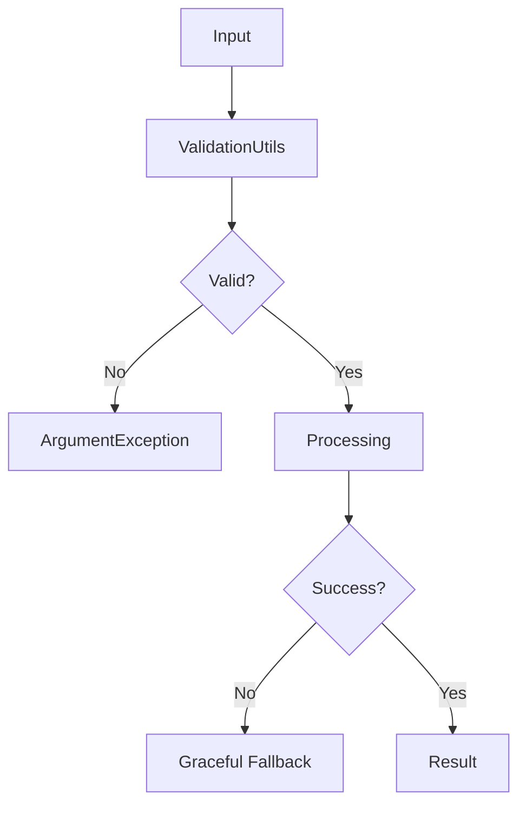

# アーキテクチャ設計書

## 概要

CurveCompressionライブラリは、時系列データの高効率圧縮を実現するUnityライブラリです。複数の圧縮アルゴリズムを統一されたAPIで提供し、拡張性と保守性を重視した設計になっています。

## アーキテクチャ原則

### 1. 関心の分離 (Separation of Concerns)
- **アルゴリズム層**: 純粋な圧縮ロジック
- **データ構造層**: 型安全なデータ表現
- **ユーティリティ層**: 共通機能とヘルパー
- **統合層**: Unity固有の機能

### 2. 依存性の逆転 (Dependency Inversion)
- `ICompressionAlgorithm`インターフェースによる抽象化
- 具象アルゴリズムは詳細実装を隠蔽
- 上位レイヤーは抽象に依存

### 3. 単一責任原則 (Single Responsibility)
- 各クラスは一つの明確な責任を持つ
- 機能的凝集性の高い設計
- 変更理由の単一化

## レイヤー構造

```
┌─────────────────────────────────┐
│        アプリケーション層         │
│   (CurveCompressionDemo)        │
├─────────────────────────────────┤
│          統合層                │
│  (UnityCompressionUtils)       │
├─────────────────────────────────┤
│          API層                 │
│    (CurveCompressor)           │
├─────────────────────────────────┤
│        コア処理層               │
│  (HybridCompressor)            │
├─────────────────────────────────┤
│       アルゴリズム層             │
│ (RDP, BSpline, Bezier)         │
├─────────────────────────────────┤
│       ユーティリティ層           │
│ (ValidationUtils, MathUtils)   │
├─────────────────────────────────┤
│      データ構造層               │
│ (TimeValuePair, CurveSegment)  │
└─────────────────────────────────┘
```

## モジュール構成

### Core モジュール
**役割**: 中核的な圧縮機能とAPIの提供

#### CurveCompressor
- **責任**: 高レベルAPI提供、結果のメトリクス計算
- **依存**: HybridCompressor、ValidationUtils
- **公開API**: `Compress(TimeValuePair[], CompressionParams)`

#### HybridCompressor  
- **責任**: アルゴリズム選択とルーティング
- **依存**: 各アルゴリズム実装
- **設計パターン**: Strategy Pattern

#### ICompressionAlgorithm
- **責任**: アルゴリズム共通インターフェース定義
- **利点**: 新しいアルゴリズムの追加が容易

### Algorithms モジュール
**役割**: 各種圧縮アルゴリズムの実装

```csharp
// 統一されたアルゴリズムインターフェース
public interface ICompressionAlgorithm
{
    CompressedCurveData Compress(TimeValuePair[] points, CompressionParams parameters);
    string AlgorithmName { get; }
    CompressionMethod SupportedMethod { get; }
}
```

#### RDPAlgorithm
- **手法**: Ramer-Douglas-Peucker線単純化
- **特徴**: 重要度重み付け、曲線タイプ選択
- **適用**: 鋭い特徴保持、データ削減

#### BSplineAlgorithm  
- **手法**: B-スプライン曲線近似
- **特徴**: 適応的セグメンテーション
- **適用**: 滑らかな連続データ

#### BezierAlgorithm
- **手法**: ベジェ曲線近似
- **特徴**: タンジェント自動計算
- **適用**: Unity AnimationCurve互換

#### ControlPointEstimator
- **責任**: 最適制御点数の自動推定
- **手法**: 7種類の推定アルゴリズム
- **出力**: 推定結果とメトリクス

### DataStructures モジュール
**役割**: 型安全なデータ表現と操作

#### 基本データ型
```csharp
public struct TimeValuePair : IComparable<TimeValuePair>
{
    public float time;
    public float value;
}
```

#### 圧縮データ表現
```csharp
public class CompressedCurveData
{
    public CurveSegment[] segments;
    public float Evaluate(float time);
    public TimeValuePair[] ToTimeValuePairs(int sampleCount);
}
```

#### 設定とパラメータ
```csharp
public class CompressionParams
{
    public float tolerance { get; set; }
    public CompressionMethod compressionMethod;
    public CompressionDataType dataType;
    public ImportanceWeights importanceWeights;
}
```

### Utilities モジュール
**役割**: 共通機能とヘルパー関数

#### ValidationUtils
- **責任**: 入力検証、エラーハンドリング
- **機能**: null/境界チェック、型検証
- **設計**: 防御的プログラミング

#### MathUtils
- **責任**: 安全な数学演算
- **機能**: ゼロ除算保護、数値安定性
- **パフォーマンス**: インライン最適化

#### InterpolationUtils
- **責任**: 高性能補間アルゴリズム
- **機能**: 線形、ベジェ、B-スプライン、Catmull-Rom
- **最適化**: バイナリサーチ、キャッシュ効率

## データフロー

### 圧縮処理フロー
```mermaid
graph TD
    A[TimeValuePair[]] --> B[ValidationUtils]
    B --> C[CompressionParams]
    C --> D[HybridCompressor]
    D --> E[Algorithm Selection]
    E --> F[RDP/BSpline/Bezier]
    F --> G[CompressedCurveData]
    G --> H[CompressionResult]
```

### エラーハンドリングフロー


## 設計パターン

### 1. Strategy Pattern
**適用**: アルゴリズム選択
```csharp
// HybridCompressor内での実装
return compressionMethod switch
{
    CompressionMethod.RDP_Linear => RDPAlgorithm.Compress(...),
    CompressionMethod.BSpline_Direct => BSplineAlgorithm.Compress(...),
    CompressionMethod.Bezier_Direct => BezierAlgorithm.Compress(...),
    // ...
};
```

### 2. Factory Pattern
**適用**: データ構造生成
```csharp
public static class CurveSegment
{
    public static CurveSegment CreateLinear(float startTime, float startValue, float endTime, float endValue);
    public static CurveSegment CreateBezier(float startTime, float startValue, float endTime, float endValue, float inTangent, float outTangent);
    public static CurveSegment CreateBSpline(Vector2[] controlPoints);
}
```

### 3. Template Method Pattern
**適用**: 共通処理フロー
```csharp
// 各アルゴリズムの共通処理
public static CompressedCurveData Compress(TimeValuePair[] points, CompressionParams parameters)
{
    // 1. 検証 (共通)
    ValidationUtils.ValidatePoints(points);
    ValidationUtils.ValidateCompressionParams(parameters);
    
    // 2. アルゴリズム固有処理
    return CompressInternal(points, parameters);
}
```

## 拡張性設計

### 新しいアルゴリズムの追加
1. `ICompressionAlgorithm`を実装
2. `CompressionMethod`列挙型に追加
3. `HybridCompressor`のswitchに追加
4. 単体テストを作成

### 新しいデータ形式の対応
1. `CompressionDataType`に追加
2. `ImportanceWeights`の対応値を追加
3. 必要に応じて新しい`CurveType`を追加

### パフォーマンス最適化ポイント
1. **メモリ効率**: 構造体の使用、配列の再利用
2. **計算効率**: SIMD対応、並列処理
3. **キャッシュ効率**: データ局所性の向上

## 品質保証

### コード品質
- **静的解析**: 全メソッドに入力検証
- **単体テスト**: 各アルゴリズム、ユーティリティ
- **統合テスト**: CurveCompressionDemo

### 実行時品質
- **エラーハンドリング**: 例外安全保証
- **メモリ安全**: リーク防止、適切な破棄
- **数値安定性**: 浮動小数点誤差対応

この設計により、高性能で拡張可能、保守性の高い曲線圧縮ライブラリを実現しています。